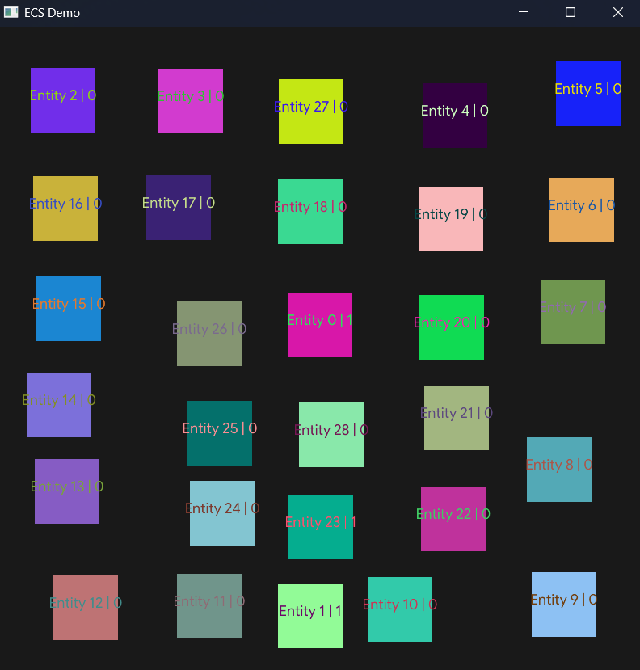

# Entity Component System
A lightweight C++ 20 Header only Entity Component System

## Features

* Create entities with multiple components at once
* Multi component operations
* Fast, zero copy component queries
* Query filtering with `With<T>()` and `Without<T>()`
* Optional entity free query results with `WithoutEntity()`
* Safe structural changes during iteration with `Stable()`
* Capacity reservation with `Reserve()`
* No external dependencies


## How to use
```cpp
#include <Ecs.hpp>

struct Position {
    float X = 0.0f;
    float Y = 0.0f;
};

struct Velocity {
    float X = 0.0f;
    float Y = 0.0f;
};

int main() {
    Ecs::Registry registry;

    Ecs::Entity entity = registry.Create();

    registry.Add<Position>(entity, 10.0f, 5.0f);
    registry.Add<Velocity>(entity, 1.0f, 0.0f);

    auto& position = registry.Get<Position>(entity);

    return 0;
}
```

## Demo Preview

